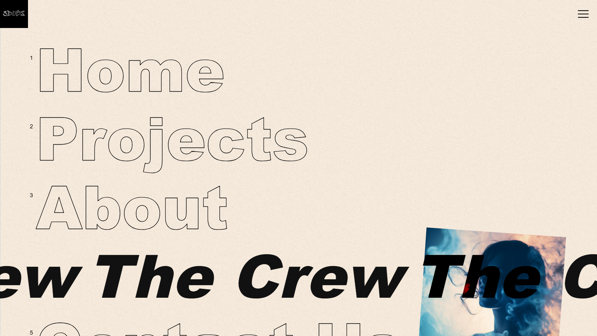
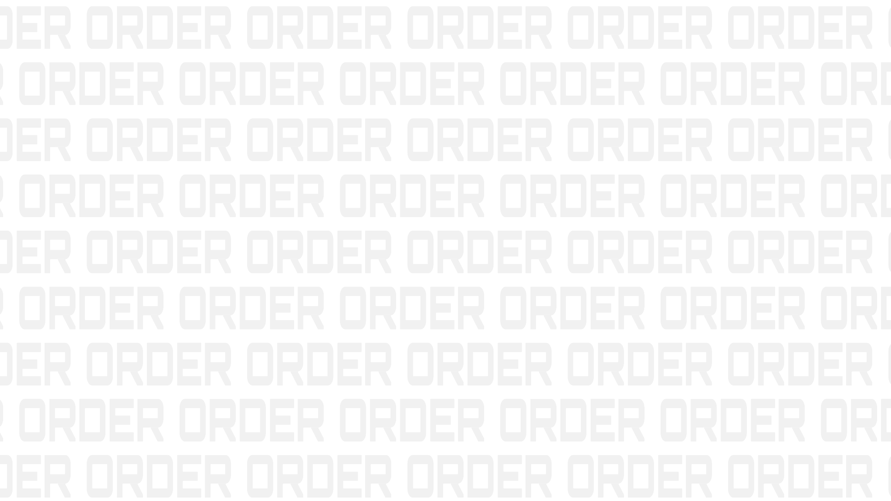
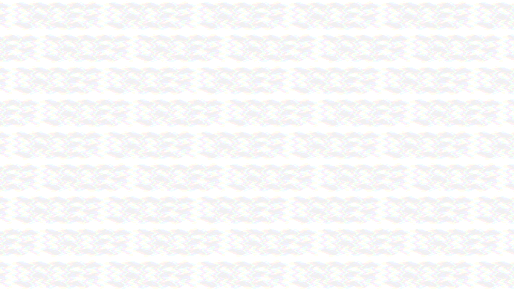
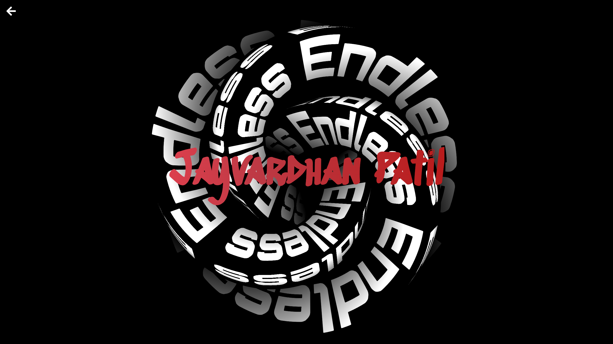
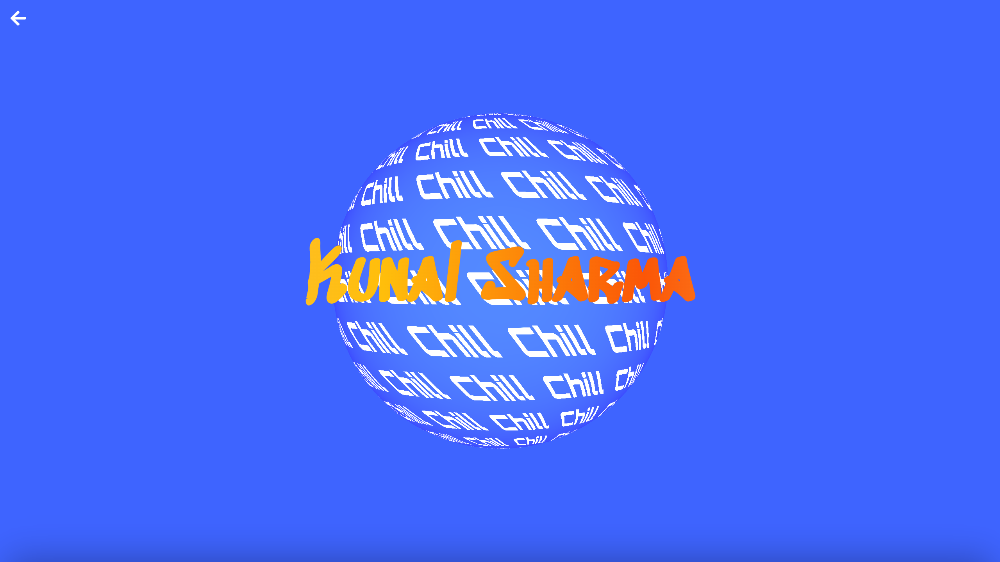
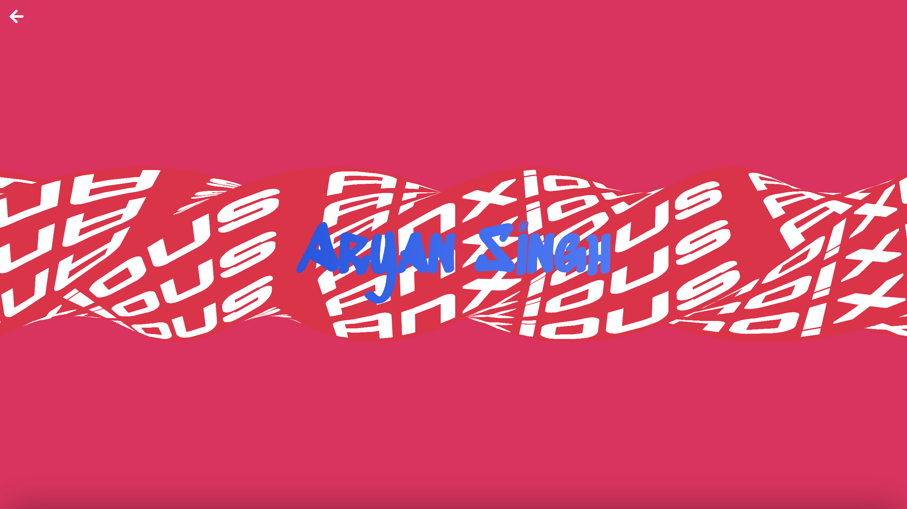
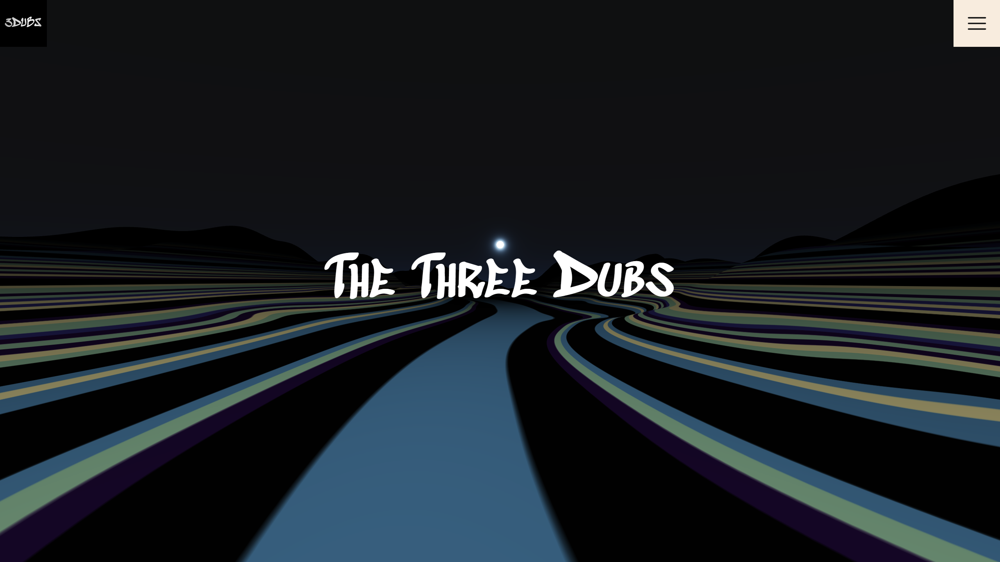
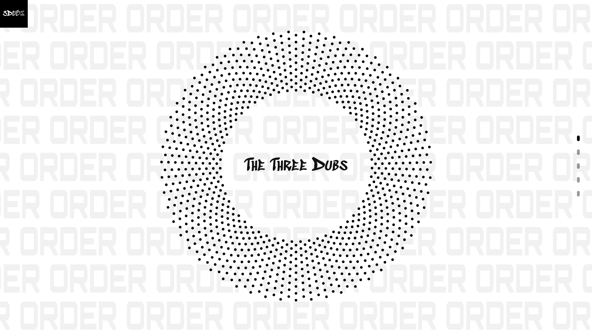

Welcome to the repository containing 3dubs.in's source code.

Feel free to clone it and run it locally. You can even modify and deploy it as long as you make sure to credit us.

### Also to get basic idea of what some components do and how they are coded, you can refer to the ReadMe below. Some of the code has been explained below.
# Table of Content
  
  * [Getting Started](#getting-started)
  * [How does the site randomizer works?](#how-does-the-site-randomizer-works-)
      - [Avoid Randomizer](#in-case-you-want-to-avoid-randomized-pages--just-directly-access-the-page-containing-that-variant-you-can-find-the-routes-to-all-variants-in---src-app---if-you-can-t-find-the-page-variant-you-want--just-create-new-route-and-import-the-desired-components-into-it)
- [Variants](#variants)
- [Marquee](#marquee)
  * [HTML & CSS based](#html---css-based)
  * [Canvas / 3D](#canvas---3d)
    + [Shaders](#shaders---)
- [3D Individual Page](#3d-individual-page)
    + [Shaders:](#shaders-)
- [Terrain](#terrain)
    * [Sky Box](#sky-box)
    * [Terrain Plane](#terrain-plan)
      + [Shaders:](#shaders--1)
    * [Cnoise Credit](#the-cnoise-function-used-in-vertex-shaders-is-open-source-code-authored-by-stefan-gustavson-properly-credited-in-the-shader-file)
        
- [Circle](#circle)
    - [Color change on Side Nav Bar hover](#implementing-color-change-on-side-nav-bar-hover)


## Getting Started

First, clone the repo:
```bash
git clone https://github.com/jayshiai/3DUBS.git
```

Then, cd into the cloned directory:
```bash
cd 3DUBS
```

Finally, run the development server:

```bash
npm run dev
# or
yarn dev
# or
pnpm dev
# or
bun dev
```

Open [http://localhost:3000](http://localhost:3000) with your browser to see the result.

## How does the site randomizer works?

If you have accessed the website, then you might have noticed that, each time you open the website in new tab or window, you get a new "experience".

This works using session storage and randomized configuration.

Basically, every time you open new session (new tab / window), the home page triggers a function that assigns a random configuration based on available variants.

Object of current variants looks like this:
```javascript
const items = {
        "intro": 3,
        "about": 2,
        "home": 9,
        "contact": 2,
        "projects": 1,
        "loading": 6,
        "cursor": 8,
        "individual": 6,
        "nav": 3
      };
```

Randomized Configuration is created using following code:
```javascript
// Define an object to store the selected configuration
      const selectedConfig = {};      
      // Iterate through each item in the list
      for (const item in items) {
        if (items.hasOwnProperty(item)) {
          // Randomly select a variant for the current item
          const randomVariant = Math.floor(Math.random() * items[item]);
          // Store the selected variant in the configuration object
          selectedConfig[item] = randomVariant;
        }
      }
```

We store this configuration into the session storage in JSON format:
```javascript
 // Convert the selected configuration object to a JSON string
      const configJSON = JSON.stringify(selectedConfig);
      // Store the configuration in Session Storage
      sessionStorage.setItem('config', configJSON);
      setVariantIndex(selectedConfig['home']);
      // Output the selected configuration
      console.log("Configuration stored in Session Storage:", selectedConfig);
    }

    const configString = sessionStorage.getItem('config');
```

Now every time a page loads in that session, it checks this stored config and uses that variant:
```javascript
 if (configString) {
      // Parse the config JSON string
      const config = JSON.parse(configString);
      // Update the variant index based on the 'home' key in the config
      setVariantIndex(config['home']);
      if (config['home'] != 5) {
        setIntroVariantIndex(config['intro']);
      }
      else {
      //special case for bindows
        setIntroVariantIndex(2);
      }
    }
    else {
    //default config in case config is missing
      setVariantIndex(0)
      setIntroVariantIndex(0);
    }
```


#### In case you want to avoid randomized pages, just directly access the page containing that variant. You can find the routes to all variants in `/src/app` . If you can't find the page variant you want, just create new route and import the desired components into it.


# Variants

I won't be explaining all the variants, but I'll cover the one's that I think are most interesting and might impart the major part of knowledge required to understand code of other variants.

# Marquee
There are two types of Marquee used in this repo.
	
 	1. HTML and CSS based
	2.  Canvas / 3D 
 
## HTML & CSS based
#### Implemented in `/src/components/nav/SimpleMarquee.jsx`
Used in one of the Navigation variant.


This is implemented by writing the text multiple times until it exceeds the screen:
```HTML
<div class="menu__item">
	<a class="menu__item-link">Home</a>
	
	<div class="marquee">
	  <div class="marquee__inner" aria-hidden="true">
		<span>Home</span>
		<span>Home</span>
		<span>Home</span>
		<span>Home</span>
		</div>
	</div>
</div>
```

The `marquee_inner` is hidden until hovered, upon which it sets `opacity to 1` and starts a `css animation`

```css
.marquee__inner {
    animation: marquee 5s linear infinite;
    animation-play-state: paused;
    opacity: 0;
    transition: opacity 0.1s;
}
@keyframes marquee {
    0% {
       transform: translate3d(-25%, 0, 0);
    }  
    100% {
        transform: translate3d(0%, 0, 0);
    }
}
```

Since we have 4 repetitions of the Text, if `translate in X direction by -25%` the first word only moves out of screen to left while other repetitions are still overflowing on right. Just as it reaches `-25%` we set it back to `0%`, thus creating illusion of infinite scroll.
## Canvas / 3D
#### Implemented in `/src/components/MarqueeText.jsx`
The ORDER/CHAOS in background of Circle and few other Home variants.


This is implemented by using Font as texture on Plane geometry and using **Vertex Shaders** to move the texture to left or right based on its Y-coordinate.

This implementation does require prior knowledge of `ThreeJS` and `Shaders` but I'll try to explain it in way that makes it easy to understand even if you don't have the required knowledge.

First, were create `Text component` using `Text` from `react-three/drei`. Pass in the font size and scale in x, y and z axis. We will specify the font family by passing its `ttf` file.
```jsx
import {Text} from "@react-three/drei";
function TextComp({ text }) {
  return (
    <Text
      fontSize={0.75}
      scale={[0.75, 3.5, 1]}
      font="../../assets/Orbitron.ttf" // the font file
      fillOpacity={0.05}
    >
      {text}
    </Text>
  );
}
```

Next, we create a plane geometry, and attach the `Shader Material` (we'll get to shader material in a moment). Then we attach the `Text component` we created by rendering it into scene using `createPortal hook` from `R3F`. `Scene` just refers to your rendered 3D space and you can think of `geomerty` as a brick wall and `material` as paint on that brick wall. 
```jsx
import BoxShaderMaterial from "./GL/material/boxShaderMaterial";

function Plane({ text, hovered, color }) {
  return (
    <>
      {createPortal(<TextComp text={text} />, scene)}
      <Plane args={[60, 45, 1]}><shaderMaterial
        ref={mat}
        attach="material"
        args={[BoxShaderMaterial]}
        uniforms-uTexture-value={target.texture} // Pass the time value to the shader
      /></Plane>
    </>
  );
}
```

Since we are animating the `material` we'll grab it using `useRef` hook from react and pass in values of `time` and `hover state` (for the glitch effect on hover) as `uniforms`. (uniforms are used in shaders)
We are using `useFrame` hook to update the `uniforms` for every frame. i.e. For 60 fps, the `unifroms` will update every `16.66667 ms`

```jsx
import { createPortal, useFrame } from "react-three-fiber";
import BoxShaderMaterial from "./GL/material/boxShaderMaterial";

function Plane({ text, hovered, color }) {
  const time = useRef(0);
  const mat = useRef();

  useFrame((state, delta) => {
    time.current += delta;
    mat.current.uniforms.uTime.value = time.current;
    mat.current.uniforms.uTransition.value = hovered ? 1.0 : 0.0;
  });

  return (
    <>
      {createPortal(<TextComp text={text} />, scene)}
      <Plane args={[60, 45, 1]}><shaderMaterial
        ref={mat}
        attach="material"
        args={[BoxShaderMaterial]}
        uniforms-uTexture-value={target.texture} // Pass the time value to the shader
      /></Plane>
    </>
  );
}
```

### Shaders :-
Moving onto the `shaders`. If you are not familiar with `Computer Graphics` or even `video games`, shaders would be a new term to you. Basically, shaders are just a piece of program that runs on every pixel and/or vertex of an image/frame. Since a single 1080p frame consists of over a million pixels and you render at least 60 Frames per second, that adds up to over 60 million computations per second. That is quite intensive and hard to run on CPU.

That's where `GLSL` comes in. It is the language in which shaders are written and it runs on GPU instead of CPU, where it is easier to run parallel computations, making it a trivial task to do those 60 million+ computations.

You might notice that `GLSL` is quite similar to `C++`.

Now, Shaders are of two types:
1. Vertex Shaders.
2. Fragment Shaders.

- Vertex shaders-
	- A Geometry ( a plane, cube, sphere or any arbitrary shape) is made up of tiny triangles.
	- Vertex shaders run their calculations for every single vertex making up these triangles.
- Fragment Shaders -
	- A frame / image is made up of pixels.
	- Fragment shaders run their computations on each pixel.

Each shader must have these two things -
1. uniforms.
2. main function.

```c++
varying vec2 vUv;
uniform sampler2D uTexture;
uniform float uTime;
uniform float uTransition; 

void main() {
      vUv = uv;
      gl_Position = projectionMatrix * modelViewMatrix * vec4(position, 1.0);
    }
```
The shader runs the `main` function for every pixel/vertex, while the `uniforms` represent constant values like the `texture` or `exact time when the shader is being rendered`

`varying` are just variable that aren't constant like `uniforms` and are mostly used to share information between `vertex shaders` and `fragment shaders`.

Also, all variable must be `float`. `GLSL` doesn't support `int`. If you want to write `int` just add `.` at its end to covert it into `float` e.g. `1.` or  `1.0`

If you remember, we just passed `time`, `texture` and `hovered state` as uniforms in the Plane shaders.

Now we retrieve those `uniforms` in `BoxShaderMaterial`
```c++
//BoxShaderMaterial
import * as THREE from "three";

  

const BoxShaderMaterial = {
  uniforms: {
    uTexture: { value: null }, // Provide a default texture value
    uTime: { value: 0 },
    uTransition: { value: 0 },
  },
};

export default BoxShaderMaterial;
```

Let's write our first basic `vertex shader`:
```c++
//BoxShaderMaterial
  vertexShader: `
    varying vec2 vUv;
    void main() {
      vUv = uv;
      gl_Position = vec4(position, 1.0);
    }
  `

export default BoxShaderMaterial;
```
`GLSL` has reserved few variable names for specific purposes. Names such as `position`, `gl_Position` and  `uv`  represent the position, final position and co-ordinates of the pixel we are working on.
Here `vUv` is the coordinate of the pixel/vertex the `vertex shader` is currently running on and is used to pass this information to `fragment shader`.
`vec1`, `vec2`, `vec3`, `vec4` are simply vectors of values. In above code, we are simply converting `position` vector, which is `vec3` into `vec4` and assigning it to final `gl_Position`


Now we'll write `Fragment Shaders` to continuously move the text in x-direction to create the marquee effect as well as apply glitch effect on hover.
```c++
//BoxShaderMaterial
  fragmentShader: `
    varying vec2 vUv;
    uniform sampler2D uTexture;
    uniform float uTime;
    uniform float uTransition; // Uniform to control the transition (0 for "Order", 1 for "Chaos")

  
    float random(float seed) {
        return fract(sin(seed) * 43758.5453);
    }

    // Function to add chromatic aberration effect during transition
    vec3 applyGlitch(vec2 uv, float time) {
      float glitchIntensity = 0.03; // Adjust the intensity of the glitch effect
      float glitchFrequency = 30.0; // Adjust the frequency of the glitch effect
      
      // Separate UV offsets for red, green, and blue channels
      vec2 redOffset = vec2(
        sin(uv.y * glitchFrequency),
        cos(uv.x * glitchFrequency)
      );

      vec2 greenOffset = vec2(
        sin(uv.y * glitchFrequency + 1.0), // Offset the green channel
        cos(uv.x * glitchFrequency + 1.0)

      );

      vec2 blueOffset = vec2(
        sin(uv.y * glitchFrequency + 2.0), // Offset the blue channel
        cos(uv.x * glitchFrequency + 2.0)
      );

      // Apply the offsets to the UV coordinates for each channel
      vec2 redUV = uv + redOffset * glitchIntensity * random(time * 30.0) * 5.;
      vec2 greenUV = uv + greenOffset * glitchIntensity * random(time * 30.0) * 2. ;
      vec2 blueUV = uv + blueOffset * glitchIntensity * random(time * 30.0) * 7.;

      // Sample the texture for each channel
      vec3 textureColor = vec3(
        texture2D(uTexture, redUV).r,
        texture2D(uTexture, greenUV).g,
        texture2D(uTexture, blueUV).b
      );  
      return textureColor;
    }

    void main() {
      float time = uTime * 0.75;
      vec2 repeat = vec2(7.0, 15.0); 
      
      // Calculate alternating lines based on vUv.y
      float alternating = mod(floor(vUv.y * repeat.y), 2.0) == 1.0 ? 1.0 : -1.0;

      // To repeat the uvs we need to multiply them by a scalar
      // and then get the fractional part of it so they go from 0 to 1
      // To move them continuously we have to add time
      // to the x or y component, to change the direction
      vec2 uv = fract(vUv * repeat + vec2(-time * alternating, 0.));

      // Apply chromatic aberration effect only when transitioning from Order to Chaos
      if (uTransition == 1.0) {
        vec3 glitchedColor = applyGlitch(uv, time);
        gl_FragColor = vec4(glitchedColor, 1.0);
      } else {
        // If not transitioning, display the texture as is
        vec3 textureColor = texture2D(uTexture, uv).rgb;
        gl_FragColor = vec4(textureColor, 1.0);
      }
    }
  `
```
Ok, that's quite a lot to unwrap. Let's start with the functions.
- `random()`
  
	`random()` function is very crude method of generating random number.

- `applyGlitch()`
  
	`applyGlitch()` function is our version of `Chromatic Abberation` effect seen mostly in films or video games.
	It is used to separate the `red`, `blue` and `green` channels of the frame and move them randomly to create glitch effect.
	This is accomplished by offsetting the `uv` of each channel. This `offset` is added back into the `uv` and the glitch intensity is set by multiplying the offset by `glitchIntensity`
	
```c++
  // Separate UV offsets for red, green, and blue channels
      vec2 redOffset = vec2(
        sin(uv.y * glitchFrequency),
        cos(uv.x * glitchFrequency)
      );

      vec2 greenOffset = vec2(
        sin(uv.y * glitchFrequency + 1.0), // Offset the green channel
        cos(uv.x * glitchFrequency + 1.0)

      );

      vec2 blueOffset = vec2(
        sin(uv.y * glitchFrequency + 2.0), // Offset the blue channel
        cos(uv.x * glitchFrequency + 2.0)
      );

      // Apply the offsets to the UV coordinates for each channel
      vec2 redUV = uv + redOffset * glitchIntensity * random(time * 30.0) * 5.;
      vec2 greenUV = uv + greenOffset * glitchIntensity * random(time * 30.0) * 2. ;
      vec2 blueUV = uv + blueOffset * glitchIntensity * random(time * 30.0) * 7.;

```

- `main()`

We passed only single `Text component`. But we want the text to repeat in both x and y direction. To accomplish this, we create a `vec2 repeat` which contains number of times we want to repeat text in x and y direction, respectively.
```c++
vec2 repeat = vec2(7.0, 15.0); 
```
Also, we want the alternating lines of text to move in opposite direction. To do this, we created `alternating` variable that calculates `vUv` of lines and sets direction to `1.0` or `-1.0` based of its position.
```c++
 float alternating = mod(floor(vUv.y * repeat.y), 2.0) == 1.0 ? 1.0 : -1.0;
```

Now we repeat the text by multiplying `vUv` by `repeat` and move whole line in x - direction by adding offset calculated using `time`. We set direction by multiplying this offset by the `alternating` variable we created.
```c++
vec2 uv = fract(vUv * repeat + vec2(-time * alternating, 0.));
```

Finally, if the state is `hovered` we apply glitch Effect and pass resultant `color` to `gl_FragColor` which is another reserved variable in `GLSL` used to represent final pixel color.
```c++
if (uTransition == 1.0) {
        vec3 glitchedColor = applyGlitch(uv, time);
        gl_FragColor = vec4(glitchedColor, 1.0);
      } 
else {
        // If not transitioning, display the texture as is
        vec3 textureColor = texture2D(uTexture, uv).rgb;
        gl_FragColor = vec4(textureColor, 1.0);
}
```
So final `main()` function is :
```c++
//BoxShaderMaterial
 void main() {
      float time = uTime * 0.75;
      vec2 repeat = vec2(7.0, 15.0); 
      
      // Calculate alternating lines based on vUv.y
      float alternating = mod(floor(vUv.y * repeat.y), 2.0) == 1.0 ? 1.0 : -1.0;

      // To repeat the uvs we need to multiply them by a scalar
      // and then get the fractional part of it so they go from 0 to 1
      // To move them continuously we have to add time
      // to the x or y component, to change the direction
      vec2 uv = fract(vUv * repeat + vec2(-time * alternating, 0.));

      // Apply chromatic aberration effect only when transitioning from Order to Chaos
      if (uTransition == 1.0) {
        vec3 glitchedColor = applyGlitch(uv, time);
        gl_FragColor = vec4(glitchedColor, 1.0);
      } else {
        // If not transitioning, display the texture as is
        vec3 textureColor = texture2D(uTexture, uv).rgb;
        gl_FragColor = vec4(textureColor, 1.0);
      }
    }
```

Thus, you have successfully implemented Marquee effect in 3D space using `ThreeJS (R3F)` and `shaders`.
# 3D Individual Page
#### Implemented in `/src/components/GL` with the shader materials in `/src/components/GL/material`


Implementing code for above 3D animation is surprisingly similar to the `3D Marquee` effect.
We basically follow the same steps.
1. Create Geometry. Here it is a torus shape.
2. Apply text as a texture.
3. Pass in time as uniform.
4. Apply shaders.

So, code for first 3 steps is almost same as `3D marquee effect` so I'll skip the explanation.
```jsx
import TorusShaderMaterial from "./material/torusShaderMaterial";
function TextComp() {
  return (
    <Text
      fontSize={1}
      scale={[0.6, 3.25, 0]}
      font="../../assets/Orbitron.ttf"
      // Specify the path to your font file
      color="white"
    >
      Endless
    </Text>
  );
}

  

function Torus() {
  const time = useRef(0);
  const mat = useRef();
  
  useFrame((state, delta) => {
    time.current += delta;
    mat.current.uniforms.uTime.value = time.current;
  });

  return (
    <>
      {createPortal(<TextComp />, scene)}
      <TorusKnot args={[9, 3, 768, 3, 4, 3]}>
        <shaderMaterial
          ref={mat}
          attach="material"
          args={[TorusShaderMaterial]}
          uniforms-uTexture-value={target.texture} // Pass the time value to the shader
        />
      </TorusKnot>
    </>
  );
}
```

### Shaders:
```c++
import * as THREE from "three";

const TorusShaderMaterial = {
  uniforms: {
    uTexture: { value: null }, // Provide a default texture value
    uTime: { value: 0 },
  },
  
  vertexShader: `
  varying vec2 vUv;
  varying vec3 vPos; 
  void main() {
    vUv = uv;
    vPos = position;  
    gl_Position = projectionMatrix * modelViewMatrix * vec4(position, 1.);
  }
  `,

  fragmentShader: `
  varying vec2 vUv;
  varying vec3 vPos;
  uniform sampler2D uTexture;
  uniform float uTime;

  void main() {
    float time = uTime * 0.5;
    vec2 repeat = -vec2(12., 3.);
    
    // To repeat the uvs we need to multiply them by a scalar
    // and then get the fractional part of it so they from 0 to 1
    // To move them continuously we have to add time
    // to the x or y component, to change the direction
    vec2 uv = fract(vUv * repeat - vec2(time, 0.)); // The sign of time change direction of movement

    // Fake shadow
    float shadow = clamp(vPos.z / 5., 0., 1.);
    vec3 texture = texture2D(uTexture, uv).rgb;

    gl_FragColor = vec4(texture * shadow, 1.);

  }`,
};

export default TorusShaderMaterial;
```

`vertex shaders` are similar as well ( to `3dMarquee` ) with only difference being that we are using `varying vPos` to pass `position` to `fragment shaders`

In `Fragment shaders` we defined `repeat` variable and set the number to times to repeat the text in x and y direction respectively.
```c++
vec2 repeat = -vec2(12., 3.);
```

Now, we just move the text by modifying `uv` based on `time`
```c++
vec2 uv = fract(vUv * repeat - vec2(time, 0.)); // The sign of time change direction of movement
```

Since, I wanted to create effect of the text emerging from Endless Void, we add a fake shadow at center
```c++
 float shadow = clamp(vPos.z / 5., 0., 1.);
 vec3 texture = texture2D(uTexture, uv).rgb;
 gl_FragColor = vec4(texture * shadow, 1.);
```

This way, we just finished creating a sleek 3D shape effect that create illusion of movement.

#### Now just modify the shape and fragment shaders for movement direction to get infinite amount of variants.
Examples. 
1. Sphere and Vertical Movement : -
		
2. Box/ Stretched Cubs and Horizontal Movement:-
		

# Terrain
#### Implemented in `/src/components/GL` with the shader materials in `/src/components/GL/material`


Terrain is made up of 2 components:
1. Sky Box
2. Terrain Plane

#### Sky Box
Simply create `Box geometry` and apply `sky shader material`  to it.
```jsx
<Box
	 scale={50}
	 args={[2, 1, 1]}
	 position={[0, 0, -40]}
>
	<shaderMaterial
		ref={sky}
		attach="material"
		args={[SkyShaderMaterial]}
	/>
</Box>
```

The `Sky Shader Material` is sourced from `ThreeJS` official docs [three.js examples (threejs.org)](https://threejs.org/examples/?q=sky#webgl_shaders_sky)

#### Terrain Plane
To create the mountainous terrain, we are just modifying `geometry vertices` using shaders. And the color is generated by applying a `pallete.png` found in `/public/pallete.png` as texture to the plane using `useLoader` hook from `R3F`. 
```jsx
const TerrainCanvas = ({ dayTime }) => {

    const texture = useLoader(THREE.TextureLoader, `./pallete${dayTime}.png`)
    return (
        <>
            <Box
                scale={50}
                args={[2, 1, 1]}
                position={[0, 0, -40]}
            >
                <shaderMaterial
                    ref={sky}
                    attach="material"
                    args={[SkyShaderMaterial]}
                />
            </Box>
            <Plane
                position={[0, -6, -180]}
                rotation={[-Math.PI / 2, 0, 0]}
                args={[100, 400, 400, 400]}
            >
                <shaderMaterial
                    ref={mat}
                    attach="material"
                    args={[PlaneShaderMaterial]}
                    uniforms-pallete-value={texture} // Pass the time value to the shader
                    fog={true}
                />
            </Plane>
        </>
    )
}
```

#### Shaders:

- Fragment Shaders:
		Here we apply the `pallete.png` as texture to our 
```c++
uniform float time;
    uniform vec3 color;
    uniform sampler2D pallete;
  
    void main(){
        vec2 stripPos = vec2( 0.0, vDisplace );
        vec4 stripColor = texture2D( pallete, stripPos );
        gl_FragColor = vec4(stripColor.rgb, 1.0);
    }
```

- Vertex Shaders:
		Here we use noise to modify plane vertices to create mountains.
```c++
void main(){

float t = time * speed;                     

vec3 noiseIn = vec3(uv, 1.0)*10.0;
float noise = cnoise(vec3(noiseIn.x, noiseIn.y + t + scroll, noiseIn.z));

float h = noise;
h*=maxHeight;

vec3 transformed = vec3( position.x, position.y, position.z + h );

vec4 mvPosition = modelViewMatrix * vec4( transformed, 1.0 );
gl_Position = projectionMatrix * mvPosition;
}
```
We generated noise and set height of that vertex in z-axis to that noise. Me multiply it with `maxHeight` to cap our height.
Since this function is run on each vertex and random function randomly assigns value, it might create spiky mess of a plane. So to create smooth and continuous mountains, we used `cnoise` function. 
#### The cnoise function used in vertex shaders is open-source code Authored by Stefan Gustavson. Properly Credited in the shader file.

##### There is lot more to the Terrain than explained above, like changing mountain height with mouse movement or creating the path between the mountains. However, for sake of brevity, I've left it out. But the code is self-explanatory.
# Circle
#### Implemented in `/src/components/RandomCircle.jsx` and `/src/components/ParticleCircle.jsx`



The circle is made up of `praticles` which are just small `spheres`. So we can just create a `particle` using `Sphere Geometry`. Since I want to position them as well as change their color, I pass them in as arguments and set the particle color using `shader material`
```jsx
const Particle = ({ position, color, scale }) => {
  const mesh = useRef();
  return (
    <mesh ref={mesh} position={position} scale={scale ? scale : 1}>
      <sphereGeometry args={[0.1, 4, 4]} />
      <meshStandardMaterial color={color} />
    </mesh>
  );
};
```

Now to generate a circle of particles, we first need to decide the positions of particles. 
Let's write a function to do this:
```jsx
const newPositions = [];
for (let j = 0; j < particleCount; j++) {
        const theta = (j / particleCount) * 2 * Math.PI;
        const x = currentRadius * Math.cos(theta);
        const y = currentRadius * Math.sin(theta);
        newPositions.push([x, y, 5]);
}
```
So we calculated the co-ordinates of particles in `Polar Co-ordinate system` and simply translated it into `Cartesian Co-ordinate system`. This will arrange particles in a circle.

To create multiple rings/circles, we just wrap above code in another loop and vary the radius of each ring:
```jsx
const newPositions = [];
for (let i = 1; i < ringCount; i++) {
	const currentRadius = radius + i * 0.5;
	for (let j = 0; j < particleCount; j++) {
        const theta = (j / particleCount) * 2 * Math.PI;
        const x = currentRadius * Math.cos(theta);
        const y = currentRadius * Math.sin(theta);
        newPositions.push([x, y, 5]);
	}
}
```

Now that we have code to generate positions for our particles, we put it in `useEffect` hook to generate position on element mount and the `map` these position to our `Particle` component.

```jsx
const ParticleCircle = ({ color, direction, ringCount, radius, hovered, moveRandomly, tapped }) => {

  const particleCount = 55;
  const group = useRef();
  const [initialPositions, setInitialPositions] = useState([]);
  const [particlePositions, setParticlePositions] = useState([]);

  

  useEffect(() => {
    const newPositions = [];
    const scale = [];
    for (let i = 1; i < ringCount; i++) {
      const currentRadius = radius + i * 0.5;
      for (let j = 0; j < particleCount; j++) {
        const theta = (j / particleCount) * 2 * Math.PI;
        const x = currentRadius * Math.cos(theta);
        const y = currentRadius * Math.sin(theta);
        newPositions.push([x, y, 5]);
      }
    }
    
    setInitialPositions(newPositions);
    setParticlePositions(newPositions);
  }, [ringCount, radius]);


  return (
    <group ref={group}>
      {particlePositions.map((position, index) => (
        <Particle
          key={index}
          position={position}
          color={moveRandomly ? (hovered ? color : 'red') : hovered ? 'red' : color}
        />
      ))}
    </group>

  );

};

export default ParticleCircle;
```

We have finished rendering the Particle Circle. All that left is to animate it by rotating it based elapsed time.
To accomplish this we use `useFrame` hook so that our animation occurs for every frame.
For every frame, we just update rotation along z-axis to create rotation effect.
```jsx
useFrame(({ clock }, delta) => {
      group.current.rotation.z = direction * clock.getElapsedTime();
});
```
Here, `direction` decides if to rotate clockwise or anti-clockwise.

![[chaoticCircle.png]]
To create chaotic, random motion of particles on click, we just change the positions randomly for every frame using `useFrame`
```jsx
  

  useFrame(({ clock }, delta) => {


      if (moveRandomly) {
        setParticlePositions((prevPositions) =>
          prevPositions.map(([x, y, z], index) => {
            if (index % 3 == 0) {
              return [
                x + (Math.random() - 0.5) * 1.0, // Increase the random displacement for an explosive effect
                y + (Math.random() - 0.5) * 1.0, // Adjust the factor based on your preference
                z, // Move particles upwards to simulate an explosion
              ]
            }
            else {
              return [
                x + (Math.random() - 0.5) * 0.25, // Increase the random displacement for an explosive effect
                y + (Math.random() - 0.5) * 0.25, // Adjust the factor based on your preference
                z, // Move particles upwards to simulate an explosion
              ]
            }
          })
        );
      } else {

        // When transitioning back from random movement, smoothly interpolate positions back to the initial configuration
        setParticlePositions((prevPositions) =>
          prevPositions.map(([x, y, z], index) => [
            x + (initialPositions[index][0] - x) * 0.1,
            y + (initialPositions[index][1] - y) * 0.1,
            5
          ])
       );
      group.current.rotation.z = direction * clock.getElapsedTime();
    }

  });
```
When setting back from chaotic to orderly, we are not setting it directly to original positions as the change would be abrupt. Instead, we have implemented LERP to provide smooth transition.
#### Implementing color change on Side Nav Bar hover
I've set up a `color state` using `useState` in parent component, which passes the `setColor` to `SideNavBar` and `color` to `RandomCircle`. 
`RandomCircle` uses this `color` to set color of Particles.
In `SideNavBar`, whenever an element is hovered, it triggers `setColor` with a new color thus changing the color which then in turn triggers re-render of `RandomCircle` with new color.

```jsx
const HomeCircle = ({ completed }) => {
    const [color, setColor] = useState('#000');
    return (
        <>   
            <RandomCircle color={color} />
            <SideNav setColor={setColor} />
        </>
    )
}
```
